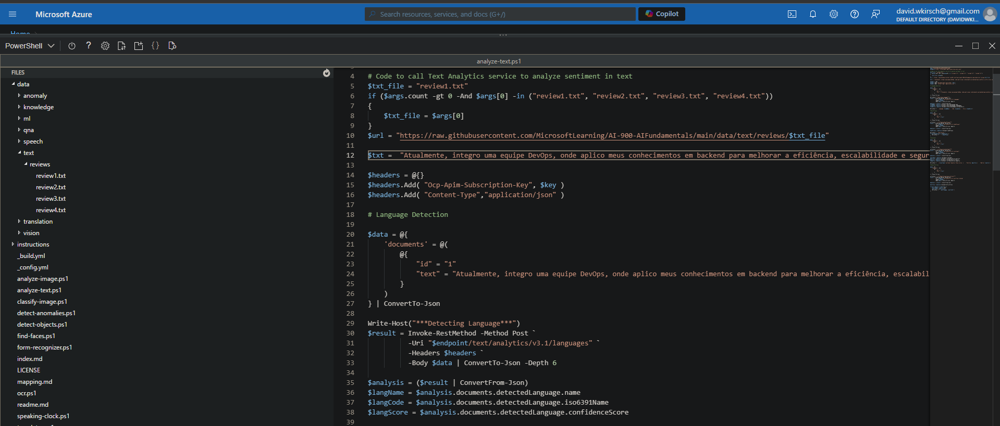
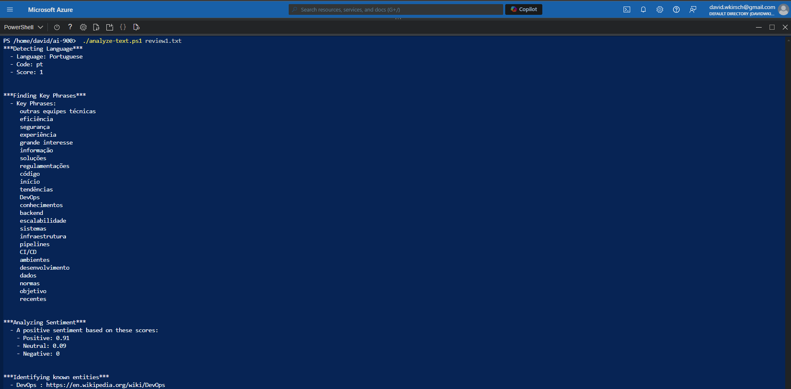

# Análise de Sentimento no Azure Text Analytics

Recentemente, utilizei o **Azure Text Analytics** para realizar uma análise de sentimento da descrição do meu perfil no LinkedIn. O processo foi uma excelente oportunidade para explorar o poder das ferramentas de inteligência artificial da Microsoft, principalmente a análise de texto, e entender como essas tecnologias podem ajudar a extrair insights úteis a partir de dados textuais.

## Etapas do Processo

### 1. Extração do Texto
O primeiro passo foi extrair a minha descrição diretamente do LinkedIn. Este texto foi o insumo principal para a análise de sentimentos, onde o objetivo era identificar se a minha descrição transmitia um sentimento positivo, negativo ou neutro.

### 2. Configuração do Azure Text Analytics
Com o texto extraído, configurei o serviço **Text Analytics** dentro da plataforma **Azure Cognitive Services**. Para isso, foi necessário criar um recurso de Text Analytics no Azure, definir as credenciais e fornecer a API key para autenticação.

### 3. Submissão do Texto para Análise
Em seguida, enviei a minha descrição de LinkedIn para o endpoint da API de análise de sentimentos do Azure. A API retornou uma pontuação que indicava a polaridade do texto (positivo, negativo ou neutro), além de uma análise mais detalhada por frases.

### Imagem 1: Tela da configuração do serviço Text Analytics no Azure

### Imagem 2: Exemplo da resposta da API com a análise de sentimento

## Resultado da Análise

A análise do Azure indicou que o sentimento geral da minha descrição no LinkedIn era **predominantemente positivo**, o que reflete a forma como eu me apresento profissionalmente, destacando minhas habilidades e experiências de uma maneira otimista.

## O que Aprendi

Uma lição importante que aprendi com essa experiência foi a **capacidade das ferramentas de inteligência artificial de capturar nuances emocionais em textos**. Isso não só permite que eu ajuste minha comunicação de forma mais estratégica, como também abre oportunidades para o uso dessas ferramentas em diversas outras aplicações, como análise de feedback de clientes e monitoramento de redes sociais.

---

Esse processo foi bastante revelador, mostrando como a análise de sentimentos pode ser um recurso valioso para aprimorar a presença digital.
